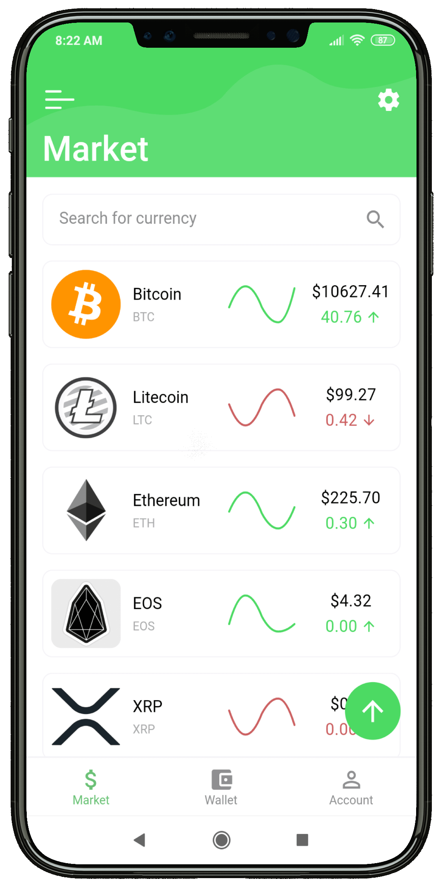
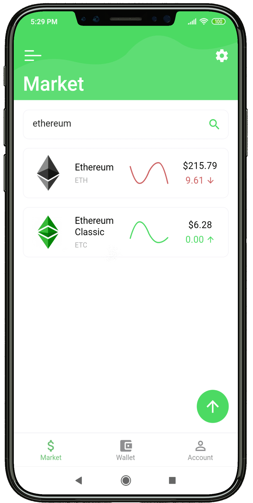
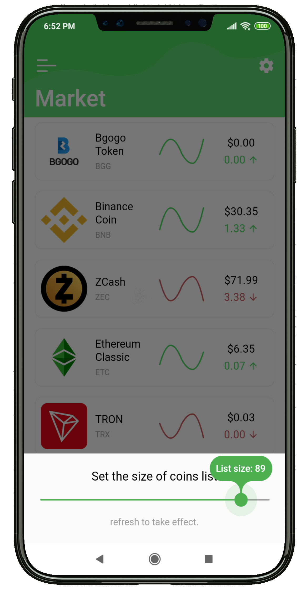
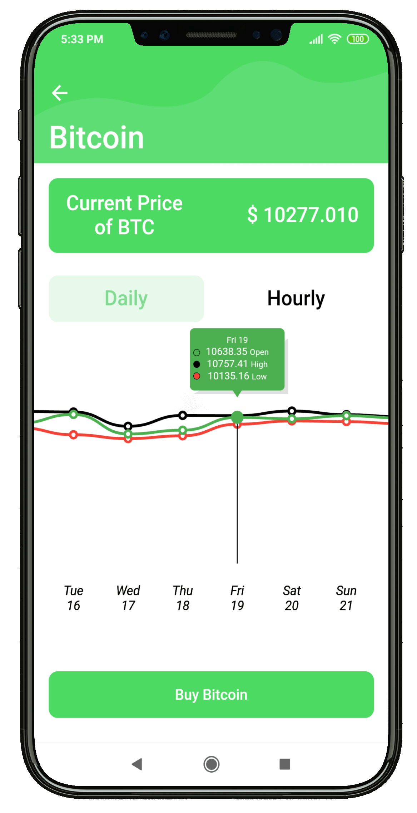

# Cryptoholic

A Cryptocurrency app made with Flutter using Provider and BLoC pattern.

UI is heavily inspired by <a href="https://dribbble.com/shots/5592695-Cryptocurrency-App-Ui/attachments/1209351">this design.</a>

You can aquire the current app version (apk) <a href="https://github.com/KarimElghamry/cryptoholic/releases/tag/v0.5-beta">here.</a>

<b>PS:</b> The apk provided above is for <b>testing purposes only.</b> 

### Show some :heart: and :star: the repo to support the project

## How to Run
- Aquire your free `API Key` from the <a href="https://min-api.cryptocompare.com/">CryptoCompare Website.<a>

- Navigate to the project's root directory and create a new file called `privateData.json` and add the following text to file:
```
{
  "apiKey": "<insert your API Key here>"
}
```

- Run the command `flutter run` using the terminal in the project's directory.

## Current Features

[✓] Display top Cryptocurrencies

[✓] Real-time data

[✓] Search for Cryptocurrencies

[✓] Refresh on demand (pull to refresh)

[✓] Daily performance charts

[✓] Hourly performance charts

[✓] Openning, high and low prices

[✓] Fancy UI


## TODO List

- Implement error handling <b>(Priority)</b>

- Add monthly and yearly charts

- Add personal account tab

- Add personal wallet and balance


## Screenshots

<p align="center">    </p>
  
 
